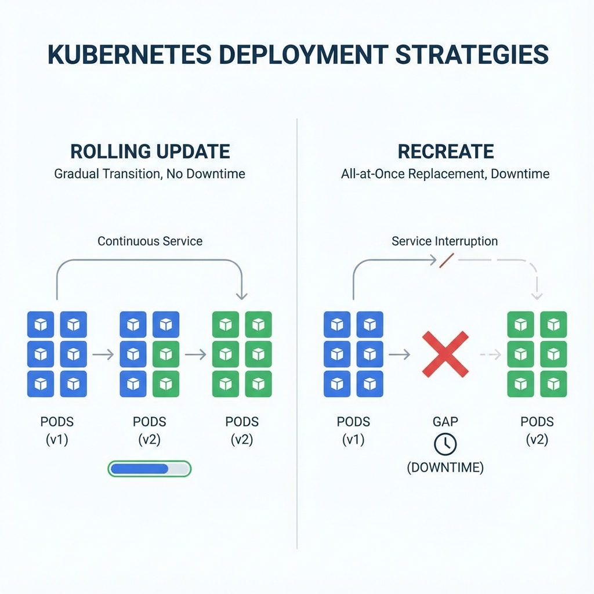
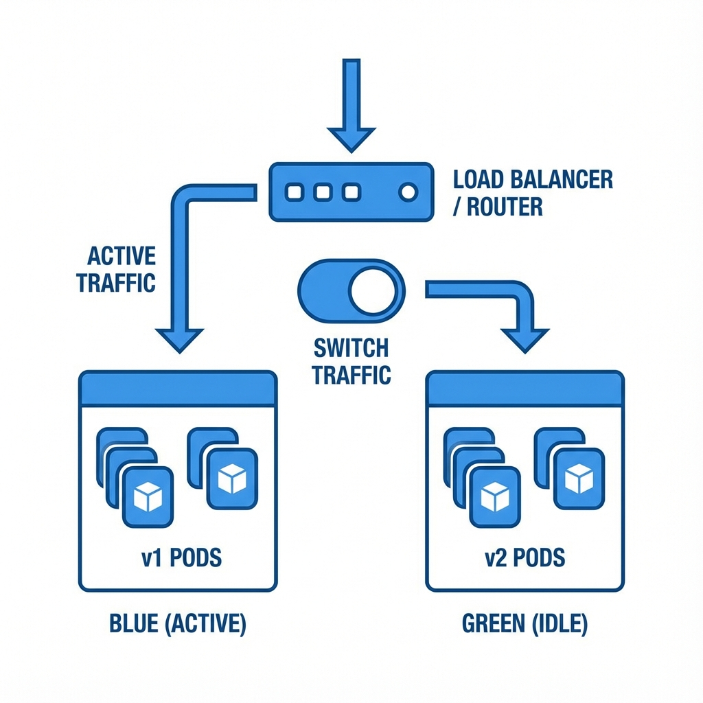

# Kubernetes Best Practices 101

In most cases, you learn to use platforms to meet the current business need or on standalone projects. The silver lining
is the encouragement of learning and at some point this becomes knowledge, however, hands-on work can lead to cuts in
paths that later cause a series of problems in productive environments. Therefore, the purpose of this guide is to help
with the learning curve, helping to prepare a more stable, reliable and functional environment.

## Documentation

* 📙 [Kubernetes Official Documentation](https://kubernetes.io/docs/home/)
* 📙 [Google Kubernetes Engine (GKE)](https://cloud.google.com/kubernetes-engine/docs/how-to)
* 📙 [Amazon Elastic Kubernetes Service (EKS)](https://docs.aws.amazon.com/eks/latest/userguide/getting-started.html)
* 📙 [Azure Kubernetes Service (AKS)](https://docs.microsoft.com/en-us/azure/aks/)

## Table of Contents

- [Container](container/container.md)
- [Cluster](#cluster)
	+ [Infrastructure](#infrastructure)
	+ [Cost Optimization](#cost-optimization)
	+ [Namespace](#namespace)
- [Basics](#basics)
    + [Security](#security)
    + [Labels](#labels)
    + [Liveness](#liveness)
    + [Readiness](#readiness)
    + [Resources](#resources)
    + [Scalability](#scalability)
    + [Deployment](#deployment)
    + [Shutdown](#shutdown)
- [Deployment and Review](#deployment-and-review)

---
---

## Cluster
---

#### Infrastructure

I don't intend to go into infrastructure best practices, but we can say that the standard 'paperwork', private VPC,
multiple networks, firewall rules etc. also apply for a kubernetes cluster. The points that need to be highlighted are:

- **Network**: Set aside a network for the cluster and make sure there is enough space for the pods and services. So
  find out how many pods per node you want to use and make calculations in cdir based on that. It's worth noting that
  each cloud provider can have its own variation and rules, so check the documentation. Practical example:
  The [GCP](https://cloud.google.com/kubernetes-engine/docs/how-to/flexible-pod-cidr#cidr_ranges_for_clusters) reserves
  double the IP for specific ranges based on the maximum pods per node, starting from 8 to 110. So, a direct translation
  is::
	- Subnetwork range (cdir): Maximum number of nodes.
	- Range for pods (cdir): Maximum number of pods based on the maximum number of pods per node. Example: A pod cdir
	  range /19 supports 256 nodes in a configuration of 16 maximum pods per node. Consequently, a subnetwork range (
	  item above) of at least /24 is required.
	- Range for services (cdir): Maximum number of services based on maximum number of pods per node.

- **Private**: Leave nodes and API restricted and/or inaccessible on the internet. So, use private clusters and, if your
  team is large enough, separate (project/account, private VPC...) them into different environments (development,
  production...).
- **Infrastructure as Code**: Keep all infrastructure versioned and well-documented with tools
  like [Terraform](https://www.terraform.io/), [CloudFormation](https://aws.amazon.com/cloudformation/?nc1=h_ls)
  or [Ansible](https://www.ansible.com/). For deployment management, I particularly think applications deserve a proper
  CD tool.

#### Cost Optimization

- **Cloud**:
	+ Pay attention to the committed use discounts plans.
	+ Choose the right type of machine, it's quite common to have discounts for specific types. For instance, GCP E2
	  types offer you 31% savings compared to the default N1.
	+ Some processes (like batch/job) don't need to be close to the user, so use the region with the most interesting
	  cost. Of course, be wary of transfers between regions and the entire lifecycle of your processes.
	+ For each application deployed, we need 10 more to monitor it. Jokes aside, be aware of the cost of monitoring.
- **Node-pools**:
	+ If you have a robust environment, create specific node-pools according to the characteristics of the applications.
	  A good example is having node-pools high memory, high cpu, and so on. The main purpose is to direct the
	  applications to the correct nodes and use as much resource as possible, as we don't want to have too much resource
	  idle.
	+ Some applications are not as sensitive or don't need to be 24/7 online. If possible, create spot/preemptible node
	  pools and only pay for a small chunk of the instance. It's important to note that there are lots of cool
	  projects ([estafette](https://github.com/estafette/estafette-gke-preemptible-killer)) to play, it's worth taking a
	  look.
	+ Enable auto-scaling to reduce cost at times with fewer users.

#### Namespace

> Use namespace profusely!

Simply put, the namespace is a way to organize objects, products and teams in Kubernetes. Namespaces provide granularity
to separate teams and/or products, in large companies, it's quite common not to know all teams, as well as development
models. Therefore, it's important to isolate and have the freedom to build a fast and secure development flow,
respecting the limits. Of course, it's important to analyze each environment, in a small company, we don't need so much
logical separation, because everyone knows each other and the cost has to make sense with the business.

Here is an example of how to do it (if possible, set quota for each namespace):

```
kubectl create namespace my-first-namespace
```

```yaml
apiVersion: v1
kind: ResourceQuota
metadata:
  name: my-first-namespace
spec:
  hard:
    requests.cpu: "10"
    requests.memory: 10Gi
    limits.cpu: "20"
    limits.memory: 20Gi
```

## Basics
---

#### Security

Just as we want to separate teams and/or products into namespaces to "walk" freely, we also need to be responsible with
security in the cluster. In other words, we don't want a security breach to happen that spreads all over the cluster,
after all, behind the cluster we have baremetal susceptible to this. Apply
all [security](https://kubernetes.io/docs/concepts/policy/pod-security-policy/) fine tuning and, if possible, don't run
container with root permission.

#### Labels

Build a table with mandatory labels to be used on objects deployed in the cluster. Despite being something simple and
trivial, having descriptive labels helps in the maintenance, visualization and understanding of the resource. Therefore,
create a best practices table with
the [recommended](https://kubernetes.io/docs/concepts/overview/working-with-objects/common-labels/) labels plus what
your team understands is necessary.

```yaml
apiVersion: apps/v1
kind: StatefulSet
metadata:
  labels:
    app.kubernetes.io/name: mysql
    app.kubernetes.io/instance: mysql-abcxzy
    app.kubernetes.io/version: "5.7.21"
    app.kubernetes.io/component: database
    app.kubernetes.io/part-of: wordpress
    app.kubernetes.io/managed-by: helm
    app.kubernetes.io/created-by: controller-manager
```

#### Liveness

In any environment, it's necessary to develop the application thinking about how to check if the health is good. In
Kuberentes, liveliness is responsible for this. The probes constantly check the application's health, in case of failure
the container is restarted and, consequently, stops serving requests. For most cases, an HTTP endpoint */health* with a
return of 200 OK is sufficient, however it is also possible to check by command or TCP.

Here is an example of how to do it:

```yaml
apiVersion: v1
kind: Pod
metadata:
  labels:
    app: liveness
  name: liveness-example
spec:
  containers:
    - name: liveness
      image: gcr.io/google-samples/hello-app:1.0
      ports:
        - containerPort: 8080
      livenessProbe:
        httpGet:
          path: /health
          port: 8080
        initialDelaySeconds: 3
        periodSeconds: 2
```

> For more details, check the [probles](https://kubernetes.io/docs/tasks/configure-pod-container/configure-liveness-readiness-startup-probes/#configure-probes): [HTTP](https://kubernetes.io/docs/tasks/configure-pod-container/configure-liveness-readiness-startup-probes/#define-a-liveness-http-request), [Command](https://kubernetes.io/docs/tasks/configure-pod-container/configure-liveness-readiness-startup-probes/#define-a-liveness-command) or [TCP](https://kubernetes.io/docs/tasks/configure-pod-container/configure-liveness-readiness-startup-probes/#define-a-tcp-liveness-probe).

#### Readiness

Like Liveness, the readiness probe is responsible for controlling whether the application is ready to receive requests.
In short, when the return is positive, it means that all the processes necessary for the application to work have
already been carried out and it is ready to receive a request. For most cases, an HTTP endpoint */ready* with a return
of 200 OK is sufficient, however it is also possible to check by command or TCP.

Here is an example of how to do it:

```yaml
apiVersion: v1
kind: Pod
metadata:
  labels:
    app: readiness
  name: readiness-example
spec:
  containers:
    - name: readiness
      image: gcr.io/google-samples/hello-app:1.0
      ports:
        - containerPort: 8080
      livenessProbe:
        httpGet:
          path: /ready
          port: 8080
        initialDelaySeconds: 3
        periodSeconds: 1
```

> For more details, check the [probles](https://kubernetes.io/docs/tasks/configure-pod-container/configure-liveness-readiness-startup-probes/#configure-probes): [HTTP](https://kubernetes.io/docs/tasks/configure-pod-container/configure-liveness-readiness-startup-probes/#define-a-liveness-http-request), [Command](https://kubernetes.io/docs/tasks/configure-pod-container/configure-liveness-readiness-startup-probes/#define-a-liveness-command) or [TCP](https://kubernetes.io/docs/tasks/configure-pod-container/configure-liveness-readiness-startup-probes/#define-a-tcp-liveness-probe).

#### Resources

Explicitly set resources on each Pod/Deployment, this makes kubernetes have great node and scale management. In
practice, with well defined features, kubernetes will place applications on correct nodes, as well as control the
scalability of node pools and applications, and prevent applications from being killed.

Defining a resource for an application is not a very simple task, however, with time assertiveness starts to appear. A
good way is to use some load testing application, such as [Locust](https://github.com/locustio/locust), and stress the
application and see how resources are being used. At the same time, it is also useful to use a VPA in recommendation
mode to compare the hints with the defined final value.

One suggestion is to set the requested memory value equal to the limit, as for cpu, we can just set the requested value.
This reason is simple, basically memory is a non-compressible resource!

Here is an example of how to do it:

```yaml
apiVersion: v1
kind: Pod
metadata:
  labels:
    app: hello-resource
  name: hello-resource
spec:
  containers:
    - name: hello-resource
      image: gcr.io/google-samples/hello-app:1.0
      ports:
        - containerPort: 8080
      resources:
        requests:
          memory: "64Mi"
          cpu: "250m"
        limits:
          memory: "64Mi"
      livenessProbe:
        httpGet:
          path: /ready
          port: 8080
        initialDelaySeconds: 3
        periodSeconds: 1
```

#### Scalability

Choose the scalability model according to the application's characteristics. In kubernetes, it's very common to use a
Horizontal Pod Autoscaler ([HPA](https://kubernetes.io/docs/tasks/run-application/horizontal-pod-autoscale/)) or
Vertical Pod Autoscaler ([VPA](https://github.com/kubernetes/autoscaler/tree/master/vertical-pod-autoscaler)).

For most cases, HPA is used with the trigger based on CPU usage. In this case, a good practice to define the target is:

```math
(CPU-HB - safety)/(CPU-HB + growth)
```

Where:

- **CPU-HB**: CPU high-bound is the usage limit on the pod. In most cases, the limit is 100%, but for node-pools that
  have a considerable percentage of idle resource, we can increase the limit.
- **safety**: We don't want the resource to reach its limit, so we set a safety threshold.
- **growth**: Percentage of traffic growth that we expect in a few minutes.

A practical example is an application where we set the limit at 100% usage for cpu, a safety threshold of 15% with an
expected traffic growth of 45% in 5 minutes:

```math
(1 - 0.15)/(1 + 0.45) = 0.58
```

Here is an example of how to do it:

```yaml
apiVersion: autoscaling/v2beta2
kind: HorizontalPodAutoscaler
metadata:
  name: my-app
spec:
  scaleTargetRef:
    apiVersion: apps/v1
    kind: Deployment
    name: my-app
  minReplicas: 1
  maxReplicas: 5
  metrics:
    - type: Resource
      resource:
        name: cpu
        target:
          type: Utilization
          averageUtilization: 58
```

#### Deployment

Regarding ReplicaSet deployment strategies, we have:

- **RollingUpdate**: Starts new replicas before deleting old ones.
	+ Pro: No Downtime.
	+ Cons: Deployment can be time-consuming and there is no traffic control between versions.
- **Recreate**: Remove all old containers and start new versions simultaneously.
    + Pro: Remove previous ~~problematic~~ versions quickly.
    + Cons: Downtime may be relevant depending on the cold start of applications.



Specifically about the means of implementation, we can highlight:

**Blue-Green**:

A blue/green deployment duplicates the environment with two parallel versions, meaning we will have a *1.0* and *2.0* version of the applications. It's a great way to reduce service downtime and ensure all traffic is transferred immediately.

To take advantage of this strategy, you need to use extensions (recommended)  such as service mesh or knative. However, for small environments, we can also do this manually as this reduces the complexity and again the cost has to make good business sense. The image below shows a way to do this manually, once the versions are online, we just need to switch traffic to the new version(green) with a load balancer/ingress.



**Canary**:

Canary deployment is a relevant way to test new versions without driving all the traffic right away. The idea is to separate a small part of users for the new version and gradually increase it until the entire flow is validated or discarded.

As well as blue-green, it is also **highly recommended** to use other solutions such as [HaProxy](http://www.haproxy.org/), [Ngnix](https://www.nginx.com/), [Spinnaker](https://spinnaker.io/). However, we can also do this manually as follows:

```yaml
kind: Service
apiVersion: v1
metadata:
  name: my-app
spec:
  sessionAffinity: ClientIP # It's important to secure the customer's session.
  selector:
    app: my-app
  ports:
    - protocol: TCP
      port: 8080
      targetPort: 8080
  type: NodePort
```
```yaml
apiVersion: apps/v1
kind: Deployment
metadata:
  name: my-app
spec:
  replicas: 9
  strategy:
    type: RollingUpdate
    rollingUpdate:
      maxUnavailable: 1
      maxSurge: 1
  selector:
    matchLabels:
      app: my-app
  template:
    metadata:
      labels:
        app: my-app
        version: 1.0
    spec:
      containers:
        - name: my-app
          image: gcr.io/google-samples/hello-app:1.0
---
apiVersion: apps/v1
kind: Deployment
metadata:
  name: my-app
spec:
  replicas: 1
  strategy:
    type: RollingUpdate
    rollingUpdate:
      maxUnavailable: 1
      maxSurge: 1
  selector:
    matchLabels:
      app: my-app
      version: 2.0
  template:
    metadata:
      labels:
        app: my-app
    spec:
      containers:
        - name: my-app
          image: gcr.io/google-samples/hello-app:2.0
```

In this example, we have a service that exposes two deployment versions (1.0 and 2.0), where the first has 9 instances and the second only 1, so it's expected that a large part of the traffic will be directed to the first version. Anyway, it's important to highlight that in order to guarantee the % of traffic, as well as the automated and smarter implementation, it's necessary to use other solutions like the ones mentioned above. Therefore, the example here is just a solution for specific cases that should not be taken as something definitive and ideal.

#### Shutdown

The kubernetes termination cycle is as follows:

1. Terminating: All flow is stopped and the pod state goes into terminating.
2. PreStop Hook: A termination alert is sent by command or HTTP request to the container to initiate the termination
   process.
3. SIGTERM Signal: A termination event is sent for the purpose of warning that the container will be terminated soon.
4. GracePeriod: Kubernetes waits for the grace period defined.
5. SIGKILL: Well, the timer has run out and the container will be removed.

Based on the cycle above, we need to ensure that our application is prepared to go through with all events and finish in
a good manner without compromising the user experience. Therefore, it's very important to use the preStopp hook, sigterm
and grace period so that we don't process any more requests and finish the ones that are in progress.

Here is an example of how to configure:

```yaml
apiVersion: v1
kind: Pod
metadata:
  name: lifecycle-terminating
spec:
  containers:
    - name: lifecycle-terminating
      image: random-image
      terminationGracePeriodSeconds: 60
      lifecycle:
        preStop:
          exec:
            command: [ "/bin/sh","-c","nginx -s quit; while killall -0 nginx; do sleep 1; done" ]
```

## Deployment and Review

---

Develop a strong CI/CD to ensure all mandatory steps are followed, as well as smooth the deployment flow for all teams.
In a way, we can put as mandatory features:

- Only use images from trusted repositories.
- Use the commit as a tag for the image.
- Use the - -*record* flag to track the version history of deployments and facilitate rollback.
- Make sure all the best practices mentioned here are being followed and disseminated among the teams.
