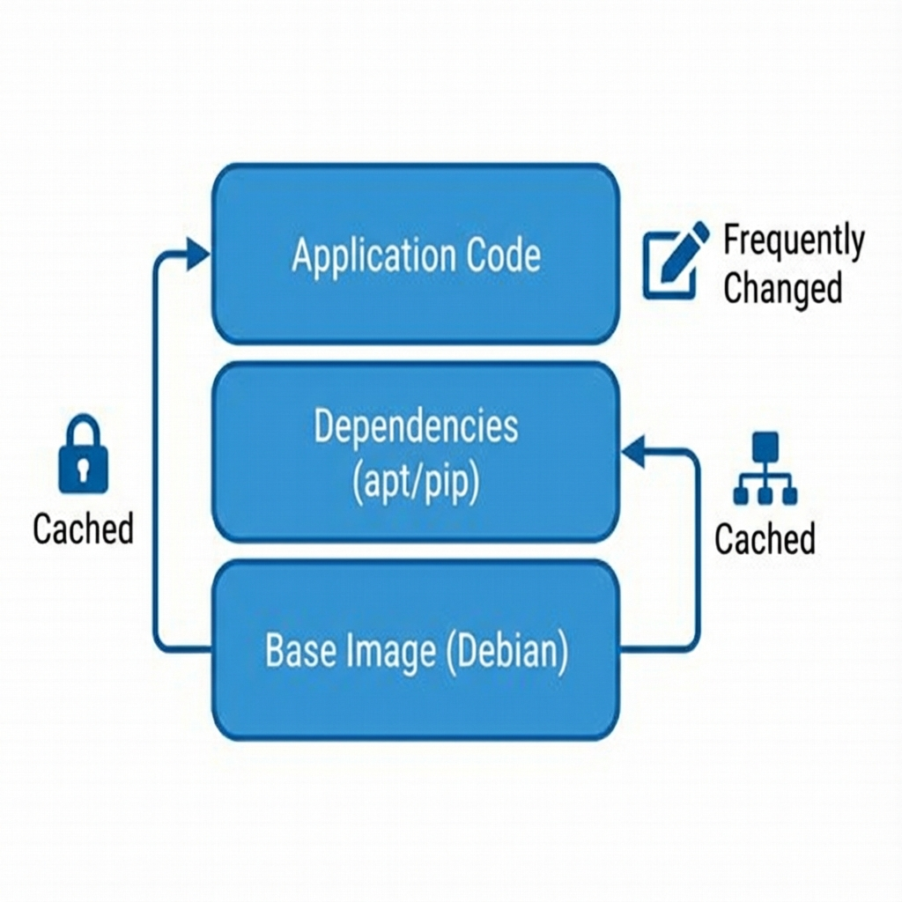
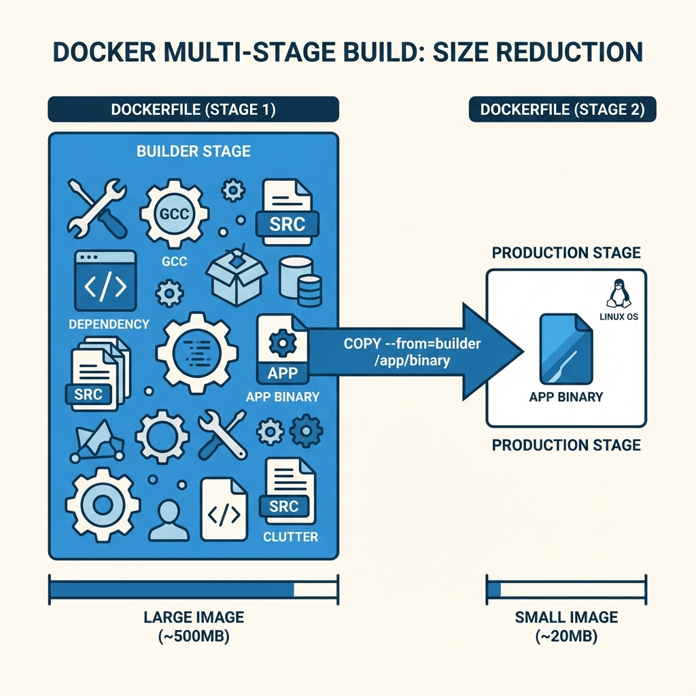
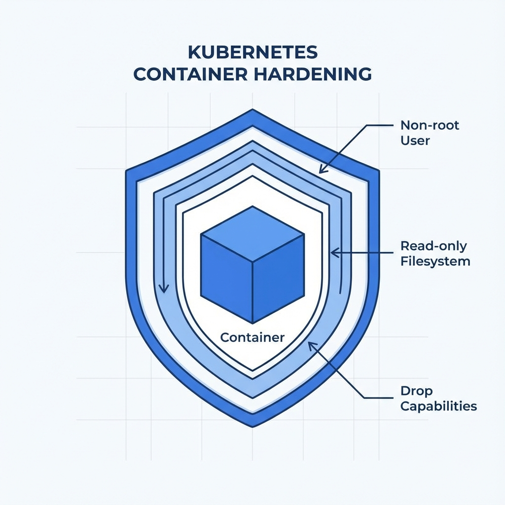

# Container

- [Stateless](#stateless)
- [Image](#image)
	+ [Base Image Selection](#base-image-selection)
	+ [Image Pull Policy](#image-pull-policy)
	+ [Cache](#cache)
	+ [Tag](#tag)
- [Dockerfile Best Practices](#dockerfile-best-practices)
	+ [Multi-stage Builds](#multi-stage-builds)
	+ [Layer Optimization](#layer-optimization)
	+ [ENTRYPOINT vs CMD](#entrypoint-vs-cmd)
	+ [ARG vs ENV](#arg-vs-env)
	+ [COPY vs ADD](#copy-vs-add)
	+ [.dockerignore](#dockerignore)
- [Security](#security)
	+ [Non-root User](#non-root-user)
	+ [Read-only Filesystem](#read-only-filesystem)
	+ [Security Context](#security-context)
	+ [Distroless and Scratch Images](#distroless-and-scratch-images)
	+ [Image Scanning](#image-scanning)
	+ [Signed Images](#signed-images)
- [Runtime](#runtime)
	+ [PID 1 and Signal Handling](#pid-1-and-signal-handling)
	+ [Graceful Shutdown](#graceful-shutdown)
	+ [Health Checks](#health-checks)
- [Observability](#observability)
	+ [Logging](#logging)
	+ [Metadata Labels](#metadata-labels)

---

## Stateless

---

Before designing any solution, it's important to review all the basic and important points ~~we are tired of knowing~~:
scale, maintenance, architecture ... **infrastructure**. To build a service that will run in a container, you need to
keep in mind a basic and extremely important point:

- **Information must be stored externally**: The container has the basic characteristic of not caring about the state,
  that is, it can be restarted. Thus, it is necessary to ensure that the container works normally, even if this happens.
  If state storage is needed, such as a database, it's indicated that this is done on an external disk; In kubernetes
  this is done via [persistence volume](https://kubernetes.io/docs/concepts/storage/persistent-volumes/).

---

## Image

---

> Smallest and fastest possible!

In services that need to scale (in most cases), it's important to pay attention to the time it takes the service to be
ready for use, aka cold start. Specifically in kubernetes, we need to pay attention to the following steps:

### Base Image Selection

Choosing the right base image is crucial for security, size, and performance. Here's a comparison:

| Base Image | Size | Security | Use Case |
|------------|------|----------|----------|
| **scratch** | ~0MB | ✅ Minimal attack surface | Statically compiled binaries (Go, Rust) |
| **distroless** | ~2-20MB | ✅ No shell, package manager | Java, Python, Node.js production |
| **alpine** | ~5MB | ⚠️ Uses musl libc | General purpose, small footprint |
| **debian-slim** | ~25MB | ⚠️ Reduced packages | When glibc compatibility is needed |
| **ubuntu** | ~75MB | ⚠️ Full distro | Development, debugging |

**Recommendations:**
- For **Go/Rust**: Use `scratch` or `distroless/static`
- For **Java**: Use `distroless/java` or `eclipse-temurin:*-alpine`
- For **Python**: Use `distroless/python3` or `python:*-slim`
- For **Node.js**: Use `distroless/nodejs` or `node:*-alpine`

```dockerfile
# Example: Go application with scratch
FROM golang:1.21-alpine AS builder
WORKDIR /app
COPY go.mod go.sum ./
RUN go mod download
COPY . .
RUN CGO_ENABLED=0 GOOS=linux go build -a -installsuffix cgo -o main .

FROM scratch
COPY --from=builder /app/main /main
ENTRYPOINT ["/main"]
```

### Image Pull Policy

- **Never**: The agent (kubelet) starts the container if it has the image locally. Otherwise it fails to start.
- **Always**: The agent searches the image locally based on the same digest, if it doesn't exist, the agent searches
  externally. (**Preferred for production**)
- **IfNotPresent**: The agent looks for the external image only if it doesn't exist locally.

Default rules can be viewed [here](https://kubernetes.io/docs/concepts/containers/images/#imagepullpolicy-defaulting).

> ⚠️ **Warning**: Never use `latest` tag in production. If you use `latest` with `IfNotPresent`, nodes may run different versions of your application.

### Cache



Just like pretty code, we don't want to repeat the same thing over and over again. So make sure the build follows at
least the following specifications:

- **If possible don't repeat the same thing over and over**: Imagine building a service that has external libs where
  they are downloaded every time to the container environment. This build tends to be very costly, as much of the
  process is consumed by downloading dependencies. In that case, cache the quirks and avoid rework.
- **Cache**: Each docker instruction is a layer with the result. Therefore, it is important to optimize this as much as
  possible, in addition to using other solutions like [Kaniko](https://github.com/GoogleContainerTools/kaniko). A
  crucial piece of information that few people pay attention to is that the layer order matters, that is, if the first
  instruction constantly changes, the remaining steps also need to be rebuilt, even if they are the same as the previous
  version. So keep the instructions that change frequently at the end of the build whenever possible.
- **BuildKit Cache Mounts**: Use BuildKit's cache mounts for package managers:

```dockerfile
# syntax=docker/dockerfile:1.4
FROM python:3.11-slim

# Cache pip packages across builds
RUN --mount=type=cache,target=/root/.cache/pip \
    pip install -r requirements.txt
```

### Tag

In productive environments, always keep tags explicit, this prevents image versions with unwanted ~~bugs~~ updates or
unexpected behavior from happening.

**Tagging strategies:**
- **Semantic versioning**: `myapp:1.2.3`
- **Git SHA**: `myapp:a1b2c3d` (recommended for traceability)
- **Combined**: `myapp:1.2.3-a1b2c3d`

> ⚠️ **Never use `latest` in production**. It's mutable and makes rollbacks unpredictable.

---

## Dockerfile Best Practices

---

### Multi-stage Builds



Separating the build into stages helps with readability and reduces the final image size, as only the last stage matters
and the rest is discarded.

```dockerfile
# Stage 1: Build
FROM node:20-alpine AS builder
WORKDIR /app
COPY package*.json ./
RUN npm ci --only=production
COPY . .
RUN npm run build

# Stage 2: Production
FROM node:20-alpine AS production
WORKDIR /app
# Copy only what's needed
COPY --from=builder /app/dist ./dist
COPY --from=builder /app/node_modules ./node_modules
USER node
EXPOSE 3000
CMD ["node", "dist/main.js"]
```

### Layer Optimization

Order your Dockerfile instructions from least to most frequently changing:

```dockerfile
# ✅ Good: Dependencies change less frequently than source code
FROM python:3.11-slim
WORKDIR /app

# 1. System dependencies (rarely change)
RUN apt-get update && apt-get install -y --no-install-recommends \
    libpq-dev \
    && rm -rf /var/lib/apt/lists/*

# 2. Python dependencies (change occasionally)
COPY requirements.txt .
RUN pip install --no-cache-dir -r requirements.txt

# 3. Application code (changes frequently)
COPY . .

CMD ["python", "main.py"]
```

**Tips:**
- Combine RUN commands to reduce layers
- Use `--no-install-recommends` for apt
- Clean up package manager caches in the same layer
- Use `--no-cache-dir` for pip

### ENTRYPOINT vs CMD

| Instruction | Purpose | Override |
|-------------|---------|----------|
| **ENTRYPOINT** | Defines the executable | Requires `--entrypoint` flag |
| **CMD** | Default arguments | Easily overridden at runtime |

**Best practice**: Use both together:

```dockerfile
# The application is always the entrypoint
ENTRYPOINT ["python", "app.py"]

# Default arguments that can be overridden
CMD ["--port", "8080"]
```

```bash
# Run with defaults
docker run myapp

# Override CMD
docker run myapp --port 9090

# Override ENTRYPOINT (rare)
docker run --entrypoint /bin/sh myapp
```

### ARG vs ENV

| Instruction | Scope | Use Case |
|-------------|-------|----------|
| **ARG** | Build-time only | Build configuration, version numbers |
| **ENV** | Build + Runtime | Application configuration |

```dockerfile
# ARG: Only available during build
ARG APP_VERSION=1.0.0
ARG BUILD_DATE

# ENV: Available at runtime
ENV NODE_ENV=production
ENV PORT=3000

# Combine: Pass build-time value to runtime
ARG GIT_SHA
ENV GIT_SHA=${GIT_SHA}
```

#### Example: Environment-based configuration

It's crucial to treat configuration as environment variables, allowing the same image to run in different environments (Dev, QA, Prod).

```dockerfile
# ❌ Bad: Hardcoded configuration
ENV DATABASE_URL=postgres://prod-server:5432/db

# ✅ Good: Configurable at runtime
ENV DATABASE_URL=""
ENV REDIS_URL=""
ENV LOG_LEVEL="info"
```

```yaml
# Kubernetes: Configure via ConfigMap and Secrets
apiVersion: v1
kind: Pod
metadata:
  name: app-config-demo
spec:
  containers:
    - name: app
      image: myapp:1.0.0
      envFrom:
        - configMapRef:
            name: app-config
        - secretRef:
            name: app-secrets
```

### COPY vs ADD

| Instruction | Features | Recommendation |
|-------------|----------|----------------|
| **COPY** | Simple file/directory copy | ✅ **Preferred** |
| **ADD** | Auto-extracts archives, supports URLs | Use only when needed |

```dockerfile
# ✅ Use COPY for regular files
COPY package.json .
COPY src/ ./src/

# ⚠️ Use ADD only for tar extraction
ADD archive.tar.gz /app/
```

### .dockerignore

Always create a `.dockerignore` file to reduce build context size and prevent sensitive files from being included:

```dockerignore
# Version control
.git
.gitignore

# Dependencies (will be installed in container)
node_modules
vendor
__pycache__
*.pyc

# Build artifacts
dist
build
*.log

# IDE and editor files
.idea
.vscode
*.swp

# Environment and secrets
.env
.env.*
*.pem
*.key

# Documentation
README.md
docs/

# Tests
tests/
*_test.go
*.test.js

# Docker files (avoid recursive builds)
Dockerfile*
docker-compose*
```

---

## Security

---

> Security is not optional in production!



### Non-root User

Never run containers as root in production. This is one of the most important security practices.

```dockerfile
FROM node:20-alpine

# Create a non-root user
RUN addgroup -g 1001 appgroup && \
    adduser -u 1001 -G appgroup -D appuser

WORKDIR /app
COPY --chown=appuser:appgroup . .

# Switch to non-root user
USER appuser

CMD ["node", "server.js"]
```

In Kubernetes, enforce this with `securityContext`:

```yaml
apiVersion: v1
kind: Pod
metadata:
  name: secure-pod
spec:
  securityContext:
    runAsNonRoot: true
    runAsUser: 1001
    runAsGroup: 1001
    fsGroup: 1001
  containers:
    - name: app
      image: myapp:1.0.0
      securityContext:
        allowPrivilegeEscalation: false
        readOnlyRootFilesystem: true
        capabilities:
          drop:
            - ALL
```

### Read-only Filesystem

Mount the container's filesystem as read-only to prevent runtime modifications:

```yaml
apiVersion: v1
kind: Pod
metadata:
  name: readonly-pod
spec:
  containers:
    - name: app
      image: myapp:1.0.0
      securityContext:
        readOnlyRootFilesystem: true
      volumeMounts:
        # Temporary directories that need to be writable
        - name: tmp
          mountPath: /tmp
        - name: cache
          mountPath: /app/.cache
  volumes:
    - name: tmp
      emptyDir: {}
    - name: cache
      emptyDir: {}
```

### Security Context

A comprehensive security context for production:

```yaml
apiVersion: v1
kind: Pod
metadata:
  name: hardened-pod
spec:
  securityContext:
    runAsNonRoot: true
    runAsUser: 1001
    runAsGroup: 1001
    fsGroup: 1001
    seccompProfile:
      type: RuntimeDefault
  containers:
    - name: app
      image: myapp:1.0.0
      securityContext:
        allowPrivilegeEscalation: false
        readOnlyRootFilesystem: true
        capabilities:
          drop:
            - ALL
          # Add only what's needed
          # add:
          #   - NET_BIND_SERVICE
      resources:
        limits:
          memory: "128Mi"
          cpu: "500m"
        requests:
          memory: "64Mi"
          cpu: "250m"
```

### Distroless and Scratch Images

For maximum security, use images with minimal or no operating system:

**Distroless** (by Google):
```dockerfile
FROM golang:1.21 AS builder
WORKDIR /app
COPY . .
RUN CGO_ENABLED=0 go build -o server .

# Distroless: No shell, no package manager
FROM gcr.io/distroless/static-debian12
COPY --from=builder /app/server /
CMD ["/server"]
```

**Scratch** (empty image):
```dockerfile
FROM golang:1.21 AS builder
WORKDIR /app
COPY . .
RUN CGO_ENABLED=0 GOOS=linux go build -ldflags="-s -w" -o server .

# Scratch: Completely empty, smallest possible
FROM scratch
# Copy CA certificates for HTTPS
COPY --from=builder /etc/ssl/certs/ca-certificates.crt /etc/ssl/certs/
COPY --from=builder /app/server /
ENTRYPOINT ["/server"]
```

### Image Scanning

Integrate vulnerability scanning into your CI/CD pipeline:

| Tool | Type | Integration |
|------|------|-------------|
| **Trivy** | Open source | CLI, CI/CD, Kubernetes |
| **Snyk** | Commercial | GitHub, GitLab, CLI |
| **Clair** | Open source | Registry scanning |
| **Grype** | Open source | CLI, CI/CD |

Example with Trivy in CI:

```yaml
# GitHub Actions
- name: Scan image for vulnerabilities
  uses: aquasecurity/trivy-action@master
  with:
    image-ref: 'myapp:${{ github.sha }}'
    format: 'sarif'
    exit-code: '1'
    severity: 'CRITICAL,HIGH'
```

```bash
# Local scanning
trivy image --severity HIGH,CRITICAL myapp:latest
```

### Signed Images

Use image signing to ensure integrity and authenticity:

```bash
# Sign with Cosign
cosign sign --key cosign.key myregistry/myapp:1.0.0

# Verify signature
cosign verify --key cosign.pub myregistry/myapp:1.0.0
```

In Kubernetes, enforce with admission controllers like Kyverno or OPA Gatekeeper:

```yaml
# Kyverno policy to require signed images
apiVersion: kyverno.io/v1
kind: ClusterPolicy
metadata:
  name: require-signed-images
spec:
  validationFailureAction: Enforce
  rules:
    - name: verify-signature
      match:
        resources:
          kinds:
            - Pod
      verifyImages:
        - image: "myregistry/*"
          key: |-
            -----BEGIN PUBLIC KEY-----
            ...
            -----END PUBLIC KEY-----
```

---

## Runtime

---

### PID 1 and Signal Handling

The first process in a container (PID 1) has special responsibilities:
- Reaping zombie processes
- Forwarding signals to child processes

**Problem**: Many applications don't handle PID 1 responsibilities correctly.

**Solution**: Use a proper init system:

```dockerfile
# Option 1: Tini (recommended)
FROM python:3.11-slim
RUN apt-get update && apt-get install -y --no-install-recommends tini \
    && rm -rf /var/lib/apt/lists/*

ENTRYPOINT ["/usr/bin/tini", "--"]
CMD ["python", "app.py"]
```

```dockerfile
# Option 2: dumb-init
FROM python:3.11-slim
RUN apt-get update && apt-get install -y --no-install-recommends dumb-init \
    && rm -rf /var/lib/apt/lists/*

ENTRYPOINT ["/usr/bin/dumb-init", "--"]
CMD ["python", "app.py"]
```

```dockerfile
# Option 3: Docker's --init flag (for local development)
# docker run --init myapp
```

### Graceful Shutdown

Your application must handle SIGTERM to shutdown gracefully:

**Python example:**
```python
import signal
import sys

def shutdown_handler(signum, frame):
    print("Received SIGTERM, shutting down gracefully...")
    # Close connections, finish pending requests
    sys.exit(0)

signal.signal(signal.SIGTERM, shutdown_handler)
```

**Node.js example:**
```javascript
process.on('SIGTERM', () => {
  console.log('Received SIGTERM, shutting down gracefully...');
  server.close(() => {
    console.log('Server closed');
    process.exit(0);
  });
});
```

**Go example:**
```go
quit := make(chan os.Signal, 1)
signal.Notify(quit, syscall.SIGTERM, syscall.SIGINT)

go func() {
    <-quit
    log.Println("Shutting down gracefully...")
    ctx, cancel := context.WithTimeout(context.Background(), 30*time.Second)
    defer cancel()
    server.Shutdown(ctx)
}()
```

In Kubernetes, configure proper termination:

```yaml
apiVersion: v1
kind: Pod
spec:
  terminationGracePeriodSeconds: 60  # Give time for graceful shutdown
  containers:
    - name: app
      lifecycle:
        preStop:
          exec:
            command: ["/bin/sh", "-c", "sleep 5"]  # Wait for load balancer update
```

### Health Checks

Docker supports native health checks:

```dockerfile
FROM python:3.11-slim

HEALTHCHECK --interval=30s --timeout=10s --start-period=5s --retries=3 \
    CMD curl -f http://localhost:8080/health || exit 1

# Or without curl
HEALTHCHECK --interval=30s --timeout=10s --retries=3 \
    CMD python -c "import urllib.request; urllib.request.urlopen('http://localhost:8080/health')"
```

> 📝 **Note**: In Kubernetes, prefer using `livenessProbe` and `readinessProbe` over Docker's HEALTHCHECK, as they provide more control and integration with the orchestrator.

---

## Observability

---

### Logging

Containers should log to stdout/stderr, not to files:

**Best practices:**
- ✅ Log to stdout/stderr
- ✅ Use structured logging (JSON)
- ✅ Include correlation IDs
- ❌ Don't log to files inside the container
- ❌ Don't use log rotation inside containers

```dockerfile
# Ensure application logs to stdout
ENV LOG_OUTPUT=stdout
ENV LOG_FORMAT=json
```

**Structured logging example (JSON):**
```json
{
  "timestamp": "2024-01-06T14:30:00Z",
  "level": "info",
  "message": "Request processed",
  "correlation_id": "abc-123",
  "method": "GET",
  "path": "/api/users",
  "status": 200,
  "duration_ms": 45
}
```

### Metadata Labels

Use OCI standard labels for image metadata:

```dockerfile
FROM python:3.11-slim

LABEL org.opencontainers.image.title="My Application"
LABEL org.opencontainers.image.description="A sample application"
LABEL org.opencontainers.image.version="1.0.0"
LABEL org.opencontainers.image.vendor="My Company"
LABEL org.opencontainers.image.url="https://github.com/myorg/myapp"
LABEL org.opencontainers.image.source="https://github.com/myorg/myapp"
LABEL org.opencontainers.image.licenses="MIT"
LABEL org.opencontainers.image.created="${BUILD_DATE}"
LABEL org.opencontainers.image.revision="${GIT_SHA}"
```

Build with dynamic labels:

```bash
docker build \
  --build-arg BUILD_DATE=$(date -u +'%Y-%m-%dT%H:%M:%SZ') \
  --build-arg GIT_SHA=$(git rev-parse HEAD) \
  -t myapp:1.0.0 .
```

---
---

## Summary Checklist

---

Before deploying a container to production, verify:

- [ ] **Image**: Using minimal base image (distroless, alpine, scratch)
- [ ] **Tag**: Using specific version tag (not `latest`)
- [ ] **User**: Running as non-root user
- [ ] **Filesystem**: Read-only root filesystem where possible
- [ ] **Security Context**: Dropping all capabilities, no privilege escalation
- [ ] **Resources**: CPU and memory limits defined
- [ ] **Health Checks**: Liveness and readiness probes configured
- [ ] **Shutdown**: Graceful shutdown handling implemented
- [ ] **Signals**: Proper PID 1 handling (tini/dumb-init if needed)
- [ ] **Logging**: Structured logs to stdout/stderr
- [ ] **Scanning**: No critical/high vulnerabilities
- [ ] **Secrets**: No hardcoded secrets in image
- [ ] **.dockerignore**: Excluding unnecessary files

---

> 📚 **Additional Resources:**
> - [Docker Best Practices](https://docs.docker.com/develop/develop-images/dockerfile_best-practices/)
> - [Kubernetes Security Best Practices](https://kubernetes.io/docs/concepts/security/overview/)
> - [CIS Docker Benchmark](https://www.cisecurity.org/benchmark/docker)
> - [OWASP Container Security](https://cheatsheetseries.owasp.org/cheatsheets/Docker_Security_Cheat_Sheet.html)
